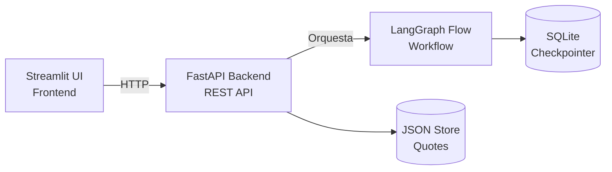
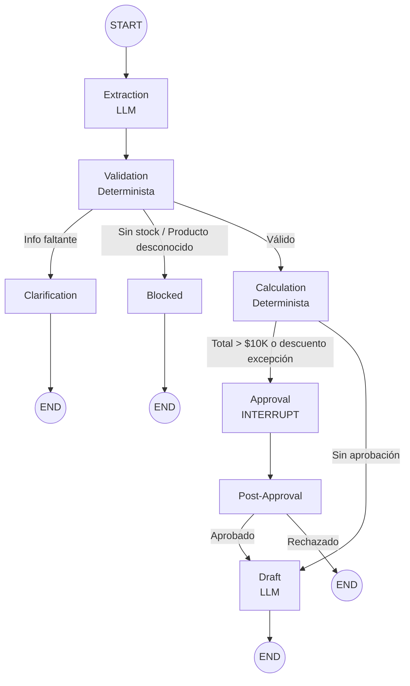

# QuoteFlow — Sistema de Cotización B2B con IA

**AndesPro Industrial** — Workflow inteligente de cotización impulsado por LangGraph.

QuoteFlow reduce el tiempo de preparación de cotizaciones automatizando la extracción, validación, cálculo de precios y generación de borradores, manteniendo supervisión humana para decisiones críticas.

## Arquitectura



## Grafo del Workflow



## Inicio Rápido

### Prerrequisitos

- Python 3.11+
- API key de OpenAI

### Instalación

```bash
# Clonar y entrar al proyecto
cd quoteflow

# Crear entorno virtual
python -m venv venv
source venv/bin/activate  # Linux/Mac
# o: venv\Scripts\activate  # Windows

# Instalar dependencias
pip install -e ".[dev]"

# Configurar entorno
cp .env.example .env
# Editar .env y agregar tu OPENAI_API_KEY
```

### Ejecutar la Aplicación

```bash
# Terminal 1: Iniciar el backend API
uvicorn backend.main:app --reload --port 8000

# Terminal 2: Iniciar el frontend Streamlit
streamlit run frontend/app.py --server.port 8501
```

### Ejecutar Tests

```bash
# Todos los tests (no requieren LLM)
pytest tests/ -v

# Con cobertura
pytest tests/ --cov=backend --cov-report=html
```

## Solicitudes de Ejemplo

Ver `data/sample_requests.json` para solicitudes de cotización que cubren:
1. **Flujo estándar** — solicitud completa, dentro de política
2. **Flujo con aprobación** — orden de alto valor que requiere revisión humana
3. **Flujo de aclaración** — información incompleta
4. **Flujo bloqueado** — stock insuficiente o producto desconocido

## Estructura del Proyecto

```
quoteflow/
├── backend/
│   ├── api/              # Endpoints FastAPI y manejo de errores
│   │   ├── endpoints/    # Handlers de rutas
│   │   ├── errors.py     # Respuestas de error uniformes
│   │   └── routes.py     # Registro de rutas
│   ├── domain/           # Lógica de negocio (determinista, sin LLM)
│   │   ├── data.py       # Datos ficticios de referencia
│   │   └── services.py   # Funciones puras del dominio
│   ├── services/         # Servicios de aplicación
│   │   └── quote_service.py  # Persistencia de cotizaciones
│   ├── workflow/          # Workflow LangGraph
│   │   ├── state.py      # Definición de estado tipado
│   │   ├── nodes.py      # Nodos del grafo (responsabilidades)
│   │   ├── graph.py      # Estructura del grafo y routing
│   │   └── engine.py     # Orquestación del workflow
│   ├── config.py         # Configuración del entorno
│   └── main.py           # Entry point de FastAPI
├── frontend/
│   └── app.py            # Aplicación Streamlit
├── tests/
│   ├── test_domain_services.py   # Tests unitarios de lógica de negocio
│   ├── test_idempotency.py       # Verificación de idempotencia
│   └── test_workflow_routing.py  # Tests de integración de routing
├── data/
│   └── sample_requests.json      # Solicitudes de ejemplo
├── docs/                  # Documentación del proyecto
├── .env.example
├── pyproject.toml
└── README.md
```

## Decisiones de Diseño Clave

- **LLM solo para interpretación y redacción** — Todos los cálculos de precios, stock, descuentos y políticas son funciones deterministas.
- **Human-in-the-loop basado en interrupt** — El mecanismo de interrupt de LangGraph pausa el workflow en el nodo de aprobación.
- **Persistencia durable** — El checkpointer SQLite sobrevive reinicios de la aplicación.
- **Respuestas API uniformes** — Todos los endpoints retornan `{success, data, error, meta}`.
- **Estado tipado** — TypedDict completo asegura consistencia entre nodos.

## Variables de Entorno

| Variable | Descripción | Default |
|----------|-------------|---------|
| `OPENAI_API_KEY` | API key de OpenAI | (requerido) |
| `APP_PORT` | Puerto del backend | 8000 |
| `CHECKPOINTER_DB_PATH` | Ruta del checkpoint SQLite | ./data/checkpoints.db |
| `DATABASE_URL` | URL de base de datos | sqlite:///./data/quoteflow.db |

## Licencia

Este proyecto está bajo la licencia MIT. Ver [LICENSE](LICENSE) para más detalles.
