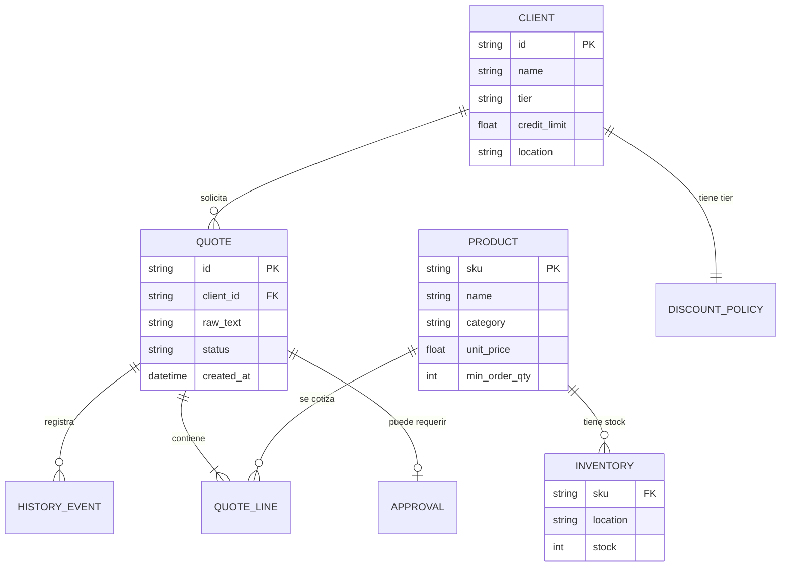

# Modelo de Datos

## Datos de Referencia (Estáticos)

Los datos de negocio viven en `backend/domain/data.py` como estructuras en memoria.
En producción, estos vendrían de un ERP o base de datos relacional.

### Clientes (`CLIENTS`)

| Campo | Tipo | Descripción |
|-------|------|-------------|
| id | string | Identificador único (CLI-XXX) |
| name | string | Razón social |
| tier | string | Nivel comercial: platinum, gold, silver, standard |
| credit_limit | float | Límite de crédito en USD |
| location | string | Ciudad principal |
| contact_email | string | Email de contacto |

**Datos actuales:** 4 clientes (CLI-001 a CLI-004)

### Productos (`PRODUCTS`)

| Campo | Tipo | Descripción |
|-------|------|-------------|
| sku | string | Código único del producto |
| name | string | Nombre descriptivo |
| category | string | Categoría: safety, equipment, parts |
| unit_price | float | Precio unitario en USD |
| currency | string | Moneda (USD) |
| min_order_qty | int | Cantidad mínima de orden |

**Datos actuales:** 6 productos (HX-200, BT-500, GL-300, WL-100, CP-750, VL-400)

### Inventario (`INVENTORY`)

| Campo | Tipo | Descripción |
|-------|------|-------------|
| sku | string | Código del producto |
| location → stock | dict[str, int] | Stock disponible por ubicación |

**Ubicaciones:** Lima, Arequipa, Piura

### Políticas de Descuento (`DISCOUNT_POLICIES`)

| Campo | Tipo | Descripción |
|-------|------|-------------|
| tier | string | Nivel del cliente |
| max_discount_pct | float | Descuento máximo permitido (%) |
| auto_approve_up_to | float | Descuento aprobado automáticamente (%) |

| Tier | Max Descuento | Auto-aprobado hasta |
|------|---------------|---------------------|
| platinum | 15% | 12% |
| gold | 10% | 8% |
| silver | 7% | 5% |
| standard | 5% | 3% |

### Constantes de Negocio

| Constante | Valor | Descripción |
|-----------|-------|-------------|
| `APPROVAL_THRESHOLD_USD` | 10,000 | Cotizaciones sobre este monto requieren aprobación |
| `RUSH_SURCHARGE_PCT` | 10% | Recargo por entrega urgente |

---

## Datos Transaccionales (Dinámicos)

### Cotizaciones (`data/quotes.json`)

Cada cotización procesada se almacena como JSON:

```json
{
  "id": "uuid",
  "client_id": "CLI-001",
  "raw_text": "texto de la solicitud",
  "status": "processing | needs_clarification | needs_approval | approved | rejected | completed | blocked | error",
  "created_at": "ISO timestamp",
  "updated_at": "ISO timestamp",
  "thread_id": "uuid (para LangGraph checkpoint)",
  "extracted_data": { ... },
  "validation_result": { ... },
  "quotation": { ... },
  "approval": { ... },
  "draft": "texto del borrador",
  "history": [
    {"timestamp": "...", "event": "...", "details": { ... }}
  ]
}
```

### Checkpoints LangGraph (`data/checkpoints.db`)

SQLite manejado internamente por LangGraph. Almacena:
- Estado del grafo en cada nodo
- Permite reanudación tras interrupciones o reinicios
- No requiere gestión manual

---

## Diagrama de Relaciones


