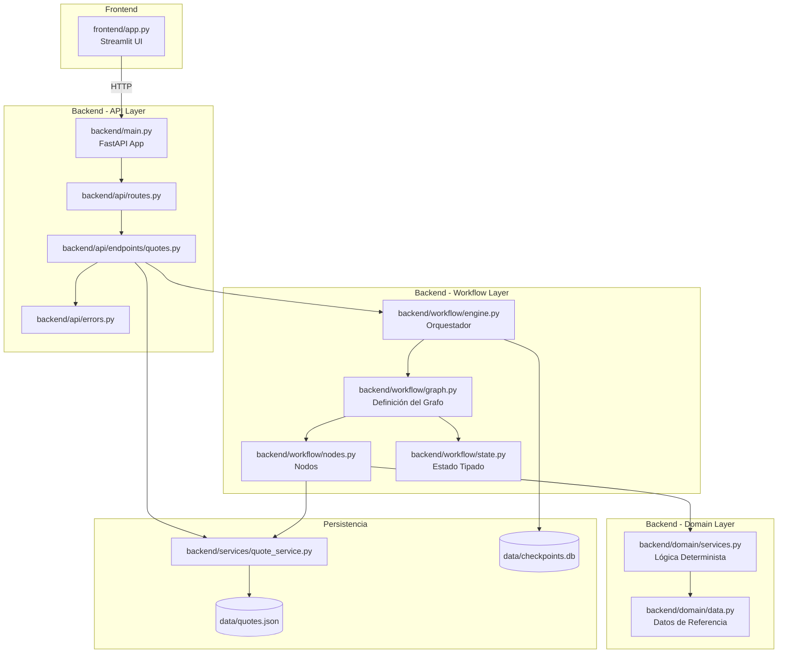
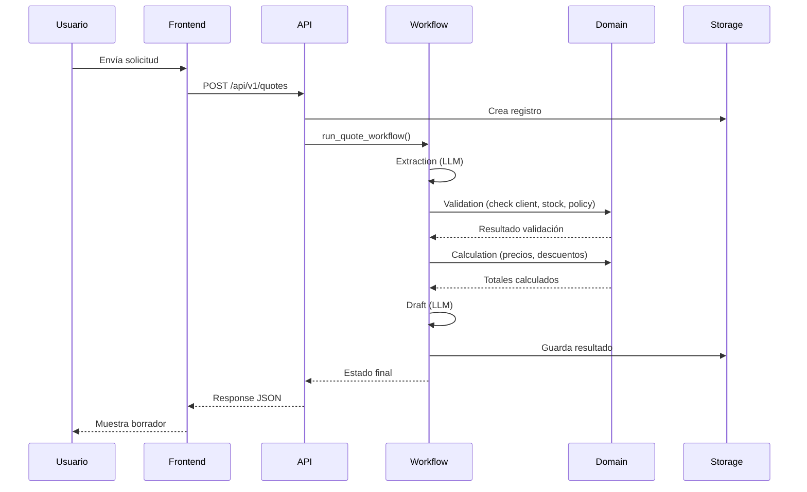
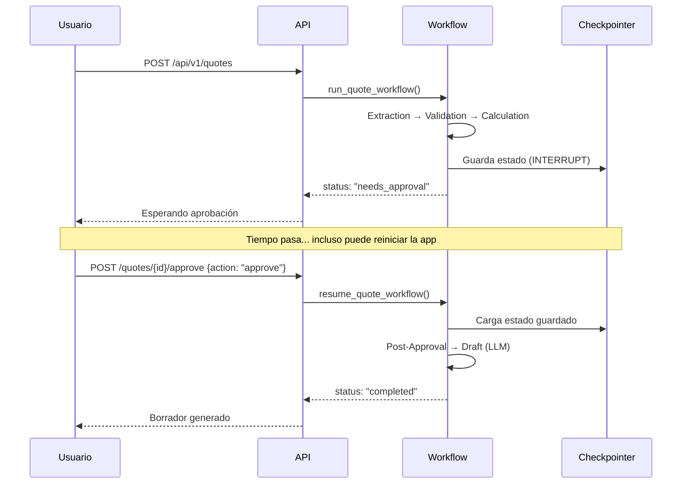

# Reporte Graphify — Mapa de Código

## Visión General del Proyecto



## Dependencias entre Módulos

| Módulo | Depende de | Es usado por |
|--------|-----------|--------------|
| `domain/data.py` | (ninguno) | `domain/services.py` |
| `domain/services.py` | `domain/data.py` | `workflow/nodes.py` |
| `workflow/state.py` | (ninguno) | `workflow/graph.py`, `workflow/engine.py` |
| `workflow/nodes.py` | `domain/services.py`, `services/quote_service.py` | `workflow/graph.py` |
| `workflow/graph.py` | `workflow/nodes.py`, `workflow/state.py` | `workflow/engine.py` |
| `workflow/engine.py` | `workflow/graph.py`, `services/quote_service.py` | `api/endpoints/quotes.py` |
| `services/quote_service.py` | `config.py` | `workflow/nodes.py`, `api/endpoints/quotes.py` |
| `api/endpoints/quotes.py` | `workflow/engine.py`, `services/quote_service.py`, `api/errors.py` | `api/routes.py` |
| `api/errors.py` | (ninguno) | `api/endpoints/quotes.py`, `main.py` |
| `main.py` | `api/routes.py`, `api/errors.py` | (entry point) |
| `frontend/app.py` | (solo HTTP a API) | (entry point) |

## Capas de Abstracción

```
┌─────────────────────────────────────────────┐
│            Frontend (Streamlit)              │  ← Solo UI, sin lógica
├─────────────────────────────────────────────┤
│            API (FastAPI)                     │  ← HTTP, validación de input
├─────────────────────────────────────────────┤
│            Workflow (LangGraph)              │  ← Orquestación, estado, routing
├─────────────────────────────────────────────┤
│            Domain (Servicios puros)          │  ← Reglas de negocio, cálculos
├─────────────────────────────────────────────┤
│            Data (Referencia estática)        │  ← Fuente de verdad
└─────────────────────────────────────────────┘
```

## Flujo de Datos por Caso de Uso

### Caso 1: Solicitud Estándar



### Caso 2: Requiere Aprobación



## Puntos de Extensión

| Si necesitas... | Modifica... | Sin tocar... |
|-----------------|-------------|--------------|
| Agregar un producto | `domain/data.py` (PRODUCTS, INVENTORY) | Todo lo demás |
| Cambiar política de descuento | `domain/data.py` (DISCOUNT_POLICIES) | Todo lo demás |
| Cambiar umbral de aprobación | `domain/data.py` (APPROVAL_THRESHOLD_USD) | Todo lo demás |
| Agregar un nodo al grafo | `workflow/nodes.py` + `workflow/graph.py` | Domain, API, Frontend |
| Cambiar proveedor LLM | `workflow/engine.py` (1 import + 1 línea) | Todo lo demás |
| Migrar a PostgreSQL | `services/quote_service.py` + `workflow/engine.py` | Domain, Nodes, Frontend |
